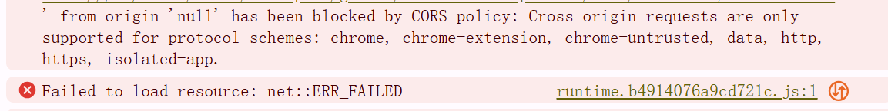

# HtmlTest

This project was generated with [Angular CLI](https://github.com/angular/angular-cli) version 15.1.0.

## Development server

Run `ng serve` for a dev server. Navigate to `http://localhost:4200/`. The application will automatically reload if you change any of the source files.

## Code scaffolding

Run `ng generate component component-name` to generate a new component. You can also use `ng generate directive|pipe|service|class|guard|interface|enum|module`.

## Build

Run `ng build` to build the project. The build artifacts will be stored in the `dist/` directory.

Deployed files and host index.html file will be found : dist/html-test/index.html
Please open this file in broswer.  
If CORS errors show up in console, here's the step to fix:  

1. Install live server in command prompt:   
npm install live-server  

2. run command inside dist folder:  
live-server 
